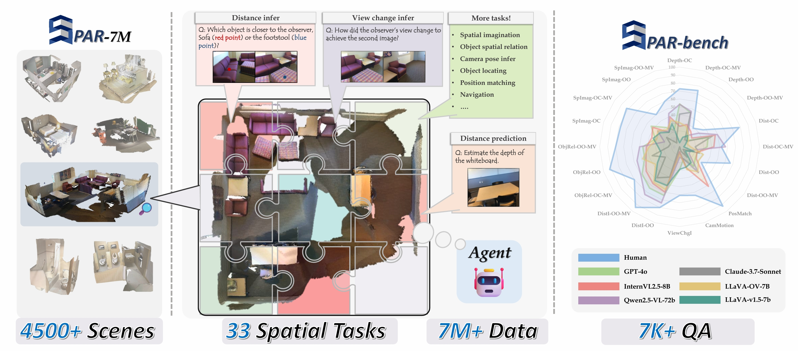
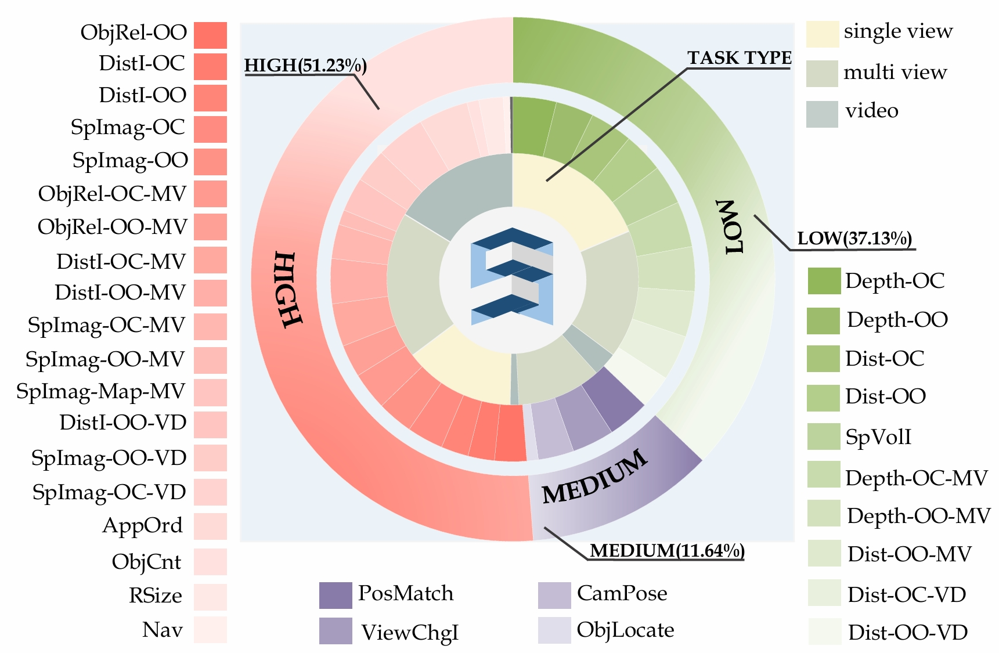
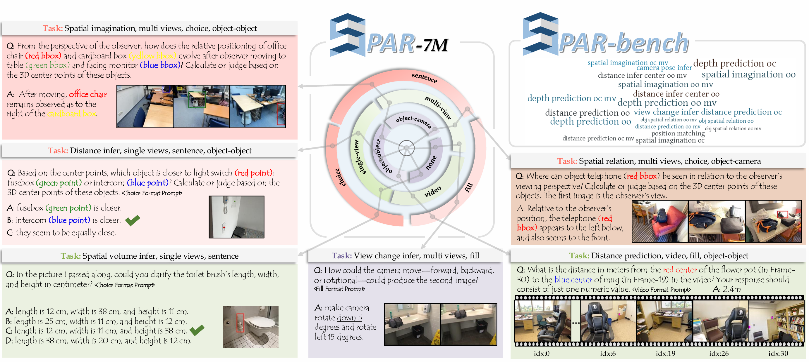

<div align="center" style="font-family: charter;">

<h1><i>From Flatland to Space</i>:</br> Teaching Vision-Language Models to Perceive and
Reason in 3D</h1>


<a href="https://arxiv.org/abs/2503.22976" target="_blank">
    
</a>
<a href="https://fudan-zvg.github.io/spar/" target="_blank">
    
</a></br>
<a href="https://huggingface.co/datasets/jasonzhango/SPAR-7M" target="_blank">
    
</a>
<a href="https://huggingface.co/datasets/jasonzhango/SPAR-Bench" target="_blank">
    
</a>
<a href="https://neurips.cc/virtual/2025/poster/121742" target="_blank">
    
</a>

<div>
    <span>Jiahui Zhang</span><sup>1*</sup>,
    <span>Yurui Chen</span><sup>1*</sup>,
    <span>Yanpeng Zhou</span><sup>2*</sup>,
    <span>Yueming Xu</span><sup>1</sup>,
    <span>Ze Huang</span><sup>1</sup>,
    <span>Jilin Mei</span><sup>1</sup>,
    <span>Junhui Chen</span><sup>1</sup>,
    <span>Yu-Jie Yuan</span><sup>2</sup>,
    <span>Xinyue Cai</span><sup>2</sup>,
    <span>Guowei Huang</span><sup>2</sup>,
    <span>Xingyue Quan</span><sup>2</sup>,
    <span>Hang Xu</span><sup>2</sup>,
    </span>
    <a href="https://lzrobots.github.io/" target="_blank">Li Zhang</a><sup>1</sup></span>
</div>

<div>
    <sup>1</sup>Fudan University&emsp;
    <sup>2</sup>Huawei Noah’s Ark Lab&emsp;
</div>


<p align="justify"><i> Overview of our <strong>Spatial Perception And Reasoning (SPAR)</strong> dataset and benchmark. Our dataset is sourced from 4,500 scenes and comprises 33 spatial tasks spanning single-view, multi-view, and video settings. Our benchmark includes over 7,000 carefully curated high-quality samples to comprehensively evaluate the spatial perception and understanding capabilities of existing models.</i></p>

</div>

📰 **News (2026-01-05):** SPAR-Bench is now supported in **EASI** — see [Evaluate via EASI](#-evaluate-via-easi).

## Contents

- [SPAR-7M](#-spar-7m)
  - [Dataset Summary](#-dataset-summary)
  - [Task Types](#-task-types)
  - [Data Format and Examples](#-data-format-and-examples)
  - [Download](#-download)
  - [Generate Training Index Files](#-generate-training-index-files)
  - [Mix Data for Pretraining](#-mix-data-for-pretraining)
  - [Visualize QA Samples](#-visualize-qa-samples)
- [SPAR-Bench](#-spar-bench)
  - [Task List & Cognitive Levels](#-task-list-&-cognitive-levels)
  - [Evaluation Results](#-evaluation-results)

- [RUN Your Own Evaluation](#-run-your-own-evaluation)
  - [Download Benchmark](#-download-benchmark)
  - [Evaluate via EASI](#-evaluate-via-easi)
  - [Set Up Environment](#-set-up-environment)
  - [Run Evaluation](#-run-evaluation)
- [Limitations](#-limitations)
- [Acknowledgement](#-acknowledgement)
- [Bibtex](#-bibtex)


## 📦 SPAR-7M
### 📌 Dataset Summary
<div align="center">
  
</div>


**SPAR-7M** is a large-scale vision-language dataset designed to study spatial perception and reasoning in complex 3D scenes. Built upon a novel 2D data generation pipeline, it translates 3D ground-truth from richly annotated scenes into diverse, scalable spatial QA pairs. The dataset spans **33 task types**, ranging from basic perception (e.g., depth, distance) to complex reasoning (e.g., spatial imagination, object relation inference), and supports **single-view**, **multi-view**, and **video-based** formats.

Unlike prior datasets, SPAR-7M focuses on spatial diversity and compositionality. It enables systematic evaluation across **object-object** and **object-camera** relations, and offers fine-grained control over QA type, view configuration, and cognitive levels.


### 🪄 Task Types
<div align="center">
  
</div>

SPAR-7M covers a wide range of spatial perception and understanding abilities, organized along multiple dimensions:
- **Cognitive Level**
  - **Low-level (Perception)**: Depth estimation, distance prediction, object location, etc.
  - **Medium-level (P-2-R)**: View change inference, object matching, etc.
  - **High-level (Reasoning)**: Spatial imagination, navigation, multi-view relation inference, etc.

- **Spatial Relation Type**
  - **Object–Object (OO)**: Inferring spatial relationships between objects.
  - **Object–Camera (OC)**: Estimating object properties relative to the camera (e.g., position, distance, direction).

- **Input Modality**
  - **Single-view**: Tasks using one image as input.
  - **Multi-view**: Tasks requiring reasoning across 3–5 images.
  - **Video**: Tasks derived from temporally coherent RGB sequences.

Each QA pair is grounded in precise 3D geometry, enabling reliable evaluation and training for spatial tasks.

### 📄 Data Format and Examples
Each QA sample consists of:
```json
{
    "id": "scene0261_00_16", 
    "conversations": 
        [{
            "from": "human", 
            "value": "With the counter (red point) having a depth of 1.6 meters, determine the depth of towel (blue point) in the same frame.  Calculate or judge based on the 3D center points of these objects. The unit is meter."},
         {
            "from": "gpt", 
            "value": "towel's central depth is estimated to be about 1.5 meters."}], 
    "image": ["scene0261_00/image_color/543.jpg"], 
    "type": "depth_prediction_oc", 
    "depth": ["scene0261_00/image_depth/543.png"],
    "red_point": [[553, 397]], 
    "blue_point": [[641, 838]]
}
```
We also provide metadata for all images, including:
- Camera intrinsics and extrinsics
- Depths

### 📥 Download

We provide **two versions** of the SPAR-7M dataset:

| Version             | Description                                                                 |
|---------------------|-----------------------------------------------------------------------------|
| `SPAR-7M`           | Clean and compact version, includes images, questions, answers, and labels. |
| `SPAR-7M-RGBD`      | Full version with additional **depths**, **camera intrinsics**, and **extrinsics**. Ideal for 3D-aware training. |

You can download both versions from **Hugging Face**:

```bash
# Download SPAR-7M (default)
huggingface-cli download jasonzhango/SPAR-7M --repo-type dataset

# Download SPAR-7M-RGBD (with depth and camera parameters)
huggingface-cli download jasonzhango/SPAR-7M-RGBD --repo-type dataset
```

These datasets are split into multiple .tar.gz parts due to Hugging Face file size limits. After downloading all parts, run the following to extract:
```
# For SPAR-7M
cat spar-*.tar.gz | tar -xvzf -

# For SPAR-7M-RGBD
cat spar-rgbd-*.tar.gz | tar -xvzf -
```

Alternatively, if Hugging Face is not accessible, you can use the [provided script](https://hf-mirror.com/):
```
wget https://hf-mirror.com/hfd/hfd.sh

chmod a+x hfd.sh

export HF_ENDPOINT=https://hf-mirror.com

./hfd.sh jasonzhango/SPAR-7M --dataset
./hfd.sh jasonzhango/SPAR-7M-RGBD --dataset
```

The dataset directory structure is:
```
spar/
├── rxr/
├── scannet/
│   ├── images/
│   |   └── scene0000_00/
│   |       ├── image_color/
│   |       ├── video_color/
│   |       ├── image_depth/           # only in SPAR-7M-RGBD
│   |       ├── video_depth/           # only in SPAR-7M-RGBD
│   |       ├── pose/                  # only in SPAR-7M-RGBD
│   |       ├── video_pose/            # only in SPAR-7M-RGBD
│   |       ├── intrinsic/             # only in SPAR-7M-RGBD
│   |       └── video_idx.txt
│   └── qa_jsonl/
│       ├── train/
│       |   ├── depth_prediction_oo/
│       |   |   ├── fill/
│       |   |   |   └── fill_76837.jsonl
│       |   |   ├── select/
│       |   |   └── sentence/
│       |   ├── obj_spatial_relation_oc/
│       |   └── spatial_imagination_oo_mv/
│       └── val/
├── scannetpp/
└── structured3d/
```
Each QA task (e.g., `depth_prediction_oc`, `spatial_relation_oo_mv`, etc.) is organized by **task type**, with subfolders for different **answer formats**:
  - `fill/` — numerical or descriptive answers
  - `select/` — multiple choice
  - `sentence/` — natural language answers

### 🛠️ Generate Training Index Files

To train models on SPAR-7M or SPAR-7M-RGBD, we first convert raw `.jsonl` QA annotations into training index files in the **InternVL-style `data_json` format**.

We provide a script to automate this:

```bash
ln -s path-to-spar-7m ./
python datasets/generate_data_json.py
```
This script will:
- Recursively scan all `*.jsonl` files under the `spar/` directory
- Convert them into structured data_json entries
- Save the output files to the `data_jsons/` folder

By default, the script processes four sub-datasets:
``` python
if __name__ == "__main__":
    dataset_list = [
        "rxr",
        "scannet",
        "scannetpp",
        "structured3d",
    ]
    for dataset in dataset_list:
        process_dataset(dataset)
``` 
You will find the generated training index files here:
``` bash
data_jsons/
├── scannet_7799k.json       # Index for all SPAR-7M QA from ScanNet scenes
├── scannetpp_5941k.json     # Index for ScanNet++ scenes
├── ...
```

### 🔀 Mix Data for Pretraining

Once you've generated individual `data_json` files, you can use the provided script to **mix them with customized ratios**, both **per-dataset** and **per QA type**.

Run the script:

```bash
ln -s path-to-spar-7m ./
python datasets/mix_data.py
```
This script supports two types of mixing control:

#### 📊 Dataset Mixing Ratio

You can control the contribution of each sub-dataset using:
``` python
mix_ratios = {
    "rxr_11k": 1.0,
    "scannet_7799k": 1.0,
    "scannetpp_5941k": 1.0,
    "structured3d_2523k": 1.0,
    # "2d_data": 0.5,  # You can also add external 2D datasets
}
```
#### 🎛️ QA Type Ratio

You can also balance different answer types to emphasize full-sentence reasoning or suppress multiple-choice overfitting:
``` python
qa_type_ratios = {
    "sentence": 1.0,
    "select": 0.1,
    "fill": 0.1,
    "judge": 0.1,
}
```
The script will output a mixed data_json file for training:
``` bash
data_jsons/
├── 1rxr_1scannet_1scannetpp_1structured3d_7m.json  # The final mixed dataset index
```
### 🧪 Visualize QA Samples
We provide a lightweight demo script to help you understand how to **load** and **visualize** the QA data in `data_json` format.

```bash
python datasets/toy_dataset.py --json_dir data_jsons/toy.json
```
This script will:
- Load QA samples from a data_json file
- Parse image paths and annotation info (e.g., bounding boxes, points, text)
- Call functions from `datasets/draw_marker.py` to render visual markers

>💡 Tip: You can modify `toy_dataset.py` to iterate over your full training set or to save the visualization outputs to disk.

## 🎯 SPAR-Bench

**SPAR-Bench** is a high-quality benchmark for evaluating the **spatial perception and understanding** capability of Vision-Language Models (VLMs), built on top of SPAR-7M with **human verification**. 
We initially sampled 8,000 questions from the validation set (400 per task), and after a thorough manual filtering process to remove ambiguous or problematic cases, the final benchmark contains **7,207 high-quality QA pairs**.

### 🧩 Task List & Cognitive Levels

SPAR-Bench contains **20 representative spatial tasks**:

| Level                           | Description                                                                 | Tasks                                                                 |
|----------------------------------|-----------------------------------------------------------------------------|------------------------------------------------------------------------|
| 🔹 Low-level Spatial Perception  | Basic perception of spatial properties such as depth and distance           | `Depth_OC`, `Depth_OC_MV`, `Depth_OO`, `Depth_OO_MV`  <br> `Dist_OC`, `Dist_OC_MV`, `Dist_OO`, `Dist_OO_MV` |
| 🔸 Medium-level Cross-view Perception | View-based alignment, motion inference, and position matching       | `PosMatch`, `CamMotion`, `ViewChg`                                     |
| 🔺 High-level Spatial Reasoning  | Multi-object reasoning and imagination across multiple views                | `DistI_OO`, `DistI_OO_MV` <br> `ObjRel_OC_MV`, `ObjRel_OO`, `ObjRel_OO_MV` <br> `SpImag_OC`, `SpImag_OC_MV`, `SpImag_OO`, `SpImag_OO_MV` |

### 📏 Evaluation Results

We evaluate a wide range of models on SPAR-Bench, including commercial APIs and open-source vision-language models.

> To ensure **fair comparison**, we exclude models that are fine-tuned on SPAR-7M (e.g., InternVL2.5-8B + SPAR-mix).  
> Under this setting:
> - 👨 **Human Level**: **67.27**
> - 🥇 **Best API model**: Qwen2.5-VL-72B — **39.40**
> - 🥇 **Best open-source model (<8B)**: SpaceR — **37.55**


#### 🔢 Performance Summary (Average Accuracy % by Level)

| Method                         | Avg.  | Low   | Medium | High  |
|--------------------------------|-------|-------|--------|-------|
| 🟤 Baselines (eval on tiny)                   |       |       |        |       |
| Human                        | **67.27** | **55.31** | **72.32**  | **76.22** |
| Random                         | 32.74 | 31.19 | 38.25  | 32.29 |
| 🟦 API Models (eval on tiny)                  |       |       |        |       |
| Qwen2.5-VL-72B                 | **39.40** | **35.35** | 23.05  | **48.44** |
| GPT-4o                         | 36.39 | 29.25 | **24.93**  | 45.11 |
| Qwen2-VL-72B                   | 35.62 | 35.28 | 23.39  | 40.00 |
| Claude-3.7-Sonnet              | 21.77 | 25.43 | 7.33  | 23.33 |
| 🟨 Open-source Models (<8B) (eval on full)    |       |       |        |       |
| SpaceR*                  | **37.55** | **30.90**  | 31.93   | **45.61** |
| InternVL2.5-8B                 | 36.28 | 29.46 | 31.88  | 43.80 |
| Qwen2.5-VL-7b                  | 33.07 | 28.75 | 22.97  | 40.27 |
| InternVL2-8B                   | 33.02 | 26.83 | **36.49**  | 37.47 |
| LLaVA-OV-7B                    | 31.20 | 21.79 | 26.13  | 40.14 |
| Qwen2-VL-7b                    | 30.74 | 27.52 | 20.44  | 37.03 |
| LLaVA-v1.5-7b                  | 23.65 | 10.85 | 27.50  | 34.09 |
| LLaVA-v1.6-7b                  | 13.21 | 8.53  | 4.79   | 20.18 |
| 🟥 Fine-tuned (SPAR-mix)       |       |       |        |       |
| **InternVL2.5-8B + SPAR-mix**  | **63.25** | **65.53** | **63.01** | **60.19** |

> \* SpaceR is trained using Reinforcement Learning with Verifiable Rewards (RLVR) on an external dataset (SpaceR-151k), with the explicit goal of improving spatial reasoning. While not fine-tuned on SPAR-Bench, SpaceR demonstrates strong generalization to our benchmark tasks.


> ⚠️ We typically **exclude fine-tuned models** (like *InternVL2.5-8B + SPAR-mix*) from direct comparison, as they are trained on SPAR-7M and thus not evaluated in a zero-shot setting.

> 📌 **Note**:
> - `Avg.` is the mean accuracy across all **20 tasks** in SPAR-Bench.
> - `Low`, `Medium`, and `High` are means over their respective **subsets** of tasks (which differ in count).
> - Therefore, `Avg.` ≠ average of Low/Medium/High.
> - Only a subset of models and results are shown here — see our [paper](#) for full per-task breakdowns.

## 🕹️ Run Your Own Evaluation
We provide tools and instructions to evaluate your own models on SPAR-Bench using [lmms-eval](https://github.com/EvolvingLMMs-Lab/lmms-eval).

### 🌐 Evaluate via EASI
We are excited to share that **SPAR-Bench has been integrated into EASI** (Holistic Evaluation of Multimodal LLMs on Spatial Intelligence), an open-source evaluation toolkit developed by **EvolvingLMMs-Lab**.

This integration connects SPAR-Bench to the broader **VLMEvalKit ecosystem**, enabling:
- **Expanded model coverage** across many VLMEvalKit-supported models (including proprietary APIs and SI-focused models).
- **Leaderboard visibility** via the continuously updated **EASI Leaderboard**.
- **Result alignment**: the EASI team reports reproduced results that align with our official baselines.

EASI currently supports:
- **SPAR-Bench**
- **SPAR-Bench (Tiny)**

Resources:
- **EASI paper (arXiv: 2508.13142)**: [Holistic Evaluation of Multimodal LLMs on Spatial Intelligence](https://arxiv.org/abs/2508.13142)
- **EASI GitHub**: [EvolvingLMMs-Lab/EASI](https://github.com/EvolvingLMMs-Lab/EASI)
- **EASI Leaderboard**: [lmms-lab-si/EASI-Leaderboard](https://huggingface.co/spaces/lmms-lab-si/EASI-Leaderboard)

### 📥 Download Benchmark
There are **four versions** of SPAR-Bench available on Hugging Face:

| Version                         | Description                                                                 |
|----------------------------------|-----------------------------------------------------------------------------|
| `SPAR-Bench`                    | Full benchmark with 7,207 QA samples across 20 tasks                        |
| `SPAR-Bench-Tiny`              | 50 QA per task (1,000 total); suitable for API or human evaluation         |
| `SPAR-Bench-RGBD`              | Full version with depth & camera pose info (for 3D-aware models)           |
| `SPAR-Bench-Tiny-RGBD`         | Tiny + RGBD version                                                         |

You can download with:

```bash
huggingface-cli download jasonzhango/SPAR-Bench --repo-type dataset
huggingface-cli download jasonzhango/SPAR-Bench-Tiny --repo-type dataset
# Or use: ./hfd.sh jasonzhango/SPAR-Bench --dataset
```
### ⚙️ Set Up Environment
Create a clean conda environment and install the necessary dependencies:
``` bash
conda create -n SPAR python=3.10
conda activate SPAR

pip install torch==2.2.2 torchvision==0.17.2 torchaudio==2.2.2 --index-url https://download.pytorch.org/whl/cu121
pip install setuptools==57.5.0 
pip install flash-attn --no-build-isolation

git clone https://github.com/xx/spar.git
cd lmms-eval
pip install -e .
```
### 🚀 Run Evaluation
You can evaluate your model on SPAR-Bench using the provided scripts:
``` bash
# For Tiny version (recommended for quick testing)
bash eval_sparbench_tiny.sh

# For Full benchmark
bash eval_sparbench.sh
```
A sample script (eval_sparbench.sh) looks like this, You can modify these arguments to fit your own model path, task name, or logging settings:
```bash
export MODEL=internvl2
export TASK=sparbench
export SUFFIX=internvl2_full
export PRETRAIN=path-to-model/InternVL2-4B

accelerate launch --main_process_port 51123 --num_processes 8 -m lmms_eval \
  --model ${MODEL} --tasks ${TASK} --batch_size 1 --log_samples --log_samples_suffix ${SUFFIX} \
  --output_path ./logs/ \
  --model_args pretrained=${PRETRAIN},dtype=bf16,attn_implementation=flash-attn
```
If you **cannot access Hugging Face**, you can still run SPAR-Bench by modifying the dataset path manually.

Open the benchmark config file:

```bash
vim lmms-eval/lmms_eval/tasks/sparbench/sparbench.yaml
```
Replace the default dataset path:
``` yaml
dataset_path: jasonzhango/SPAR-Bench
```
With your local dataset path, e.g.:
``` yaml
dataset_path: /cache/your_path/SPAR-Bench
```


## ⚠️ Limitations

While SPAR-Bench has undergone extensive manual filtering to ensure question quality and clarity, it may still contain occasional ambiguities, edge cases, or annotation issues. We welcome feedback from the community — if you spot any mistakes or unclear samples, feel free to open an issue or pull request.

Additionally, if you find any part of the codebase unclear or hard to use, please let us know. We are committed to continuously improving both the benchmark and its usability.


## 🙏 Acknowledgement

We would like to thank the following projects for their contributions and inspiration:

- [lmms-eval](https://github.com/EvolvingLMMs-Lab/lmms-eval): used as the evaluation framework for SPAR-Bench.
- [thinking-in-space](https://github.com/vision-x-nyu/thinking-in-space): inspired the design of spatial tasks and benchmark formulation.

Their work laid important groundwork for evaluating spatial reasoning in vision-language models.


## 📚 Bibtex

If you find this project or dataset helpful, please consider citing our paper:

```bibtex
@article{zhang2025from,
    title={From Flatland to Space: Teaching Vision-Language Models to Perceive and Reason in 3D},
    author={Zhang, Jiahui and Chen, Yurui and Zhou, Yanpeng and Xu, Yueming and Huang, Ze and Mei, Jilin and Chen, Junhui and Yuan, Yujie and Cai, Xinyue and Huang, Guowei and Quan, Xingyue and Xu, Hang and Zhang, Li},
    year={2025},
    journal={arXiv preprint arXiv:2503.22976},
}
```
